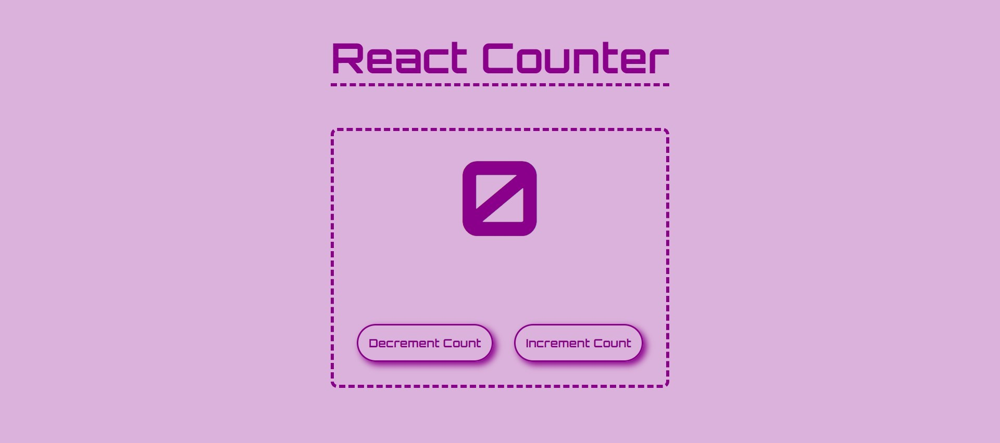

# React Counter 

In this small counter app i have learned about the **``React useState Hook``** 

- The useState hook is a build-in hook in React that allows functional components to manage state.
- It provides a way to add stateful behavior to functional components without the need for class components.
- With the useState hook, we can declare and update state variables within the body of a functional components.

---

## Basic Syntax -

```jsx
import { useState } from 'react';

const MyComponent = () => {
    const [ state, setState ] = useState(initialStateValue);

    // REST OF THE COMPONENT CODE

    return (

        // JSX REPRESENTATION OF COMPONENT'S UI
    );
};
```
### Syntax Break Down -
- ``Importing useState`` :- Import the useState function / hook from the 'react' package.
- ``Declaring state`` :- Declare a state variable using array destructuring.
    - The 'state' variable holds the current value of state.
    - The 'setState' function is used to update the state.
    - we can choose any names for these variables & update functions.
- ``Initial State`` :- Pass an initaial value of the useState function. This value will be used as the initial state of the state variable.
- ``Updating State`` :- To update the state, we call the 'setState' function and padd the new value. React will re-render the component and update the UI with the new state value.

---

## React Counter Component Code -
```jsx
import React from 'react';
import { useState } from 'react';

const Counter = () => {
    const [count, setCount] = useState(0);

    const handleIncrement = () => {
        setCount(count + 1);
    }

    const handleDecrement = () => {
        if (count > 0) {
            setCount(count - 1);
        }
    }
  return (
    <>
      <h1 className='counter'>{count}</h1>
      <div className="btn-container">
        <button className="btn" type='button' onClick={handleDecrement}>
            Decrement Count
        </button>
        <button className="btn" type='button' onClick={handleIncrement}>
            Increment Count
        </button>
      </div>

    </>
  )
}

export default Counter
```
### Code logic - 
- import useState function from 'react' package in order to use the useState hook in our project.
- create an default export react arrow function named 'Counter'.
- inside the counter component destructure the two values of useState function i.e. count (variable to hold the current state), setCount (function to update the state), also define the initial value of our count variable to 0.
- now we need an element to dynamically display our count value, to achieve that we created a h1 element and use our count variable inside h1 element.
- now we need two buttons - one for increment the value by 1, other for decrement the value by 1.
- to make our buttons functional we need to target some event (like - onClick [whenever a user click on the button do something]).
- now we need to handle that onClick event, basically we need event handler functions to tell react what to do when this particular button is clicked.
- so here we have two event handler functions i.e. handleIncrement() and handleDecrement ().
- inside these functions we need to update our state value. (i.e. count value).
- for increment we simply increment count by 1.
- for decrement we need to check if count > 0 only thwn decrement count by 1. because we do not want our counter to display -ve values or go below Zero.

---

## Output -


---

> All files are given in the ``src`` folder.

> Download project and extract it.

> Open project in your CLI.

> Open terminal and type ``npm i`` or ``npm install`` to install all the dependencies.

> Type ``npm start`` in the terminal to run the app.

---

# THANK-YOU !